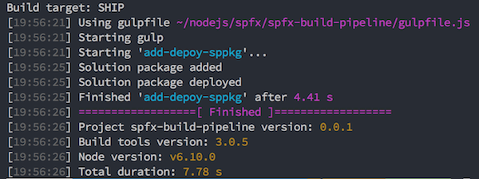

# SharePoint solution ALM actions

[](https://nodei.co/npm/node-sp-alm/)

This project is created for automating the deployment process of SharePoint solution packages to the App Catalog. This module uses the new ALM APIs that are available on SharePoint Online tenants.

> More information about the Application Lifecycle Management (API) can be found here: [https://docs.microsoft.com/en-us/sharepoint/dev/apis/alm-api-for-spfx-add-ins](https://docs.microsoft.com/en-us/sharepoint/dev/apis/alm-api-for-spfx-add-ins)

## Installation
Run the following command to install the `node-sp-alm`:

```
$ npm install node-sp-alm --save-exact
```

## Usage

Once you installed this dependency to your project. You can make use of the following provides sample to add and deploy the solution package:

```javascript
const sppkg = require('node-sp-alm');
const fs = require('fs');
const path = require('path');

const fileName = "solution-package.sppkg";

const spAlm = new sppkg.ALM({
  "username": "your-username",
  "password": "your-password",
  "tenant": "your-tenant-name (ex.: contoso)",
  "verbose": true
});

// Retrieve the solution package
const fileContent = fs.readFileSync(path.join(__dirname, `./${fileName}`));
// First add the SharePoint package
const appData = await spAlm.add(fileName, fileContent);
console.log('Solution package added');
// Deploy the SharePoint package based on the package ID
await spAlm.deploy(appData.UniqueId, skipFeatureDeployment)
console.log('Solution package deployed');
```

## Available actions

Currently the following actions are supported:

### Action: list

List returns the available apps.

```
spAlm.list()
```

Arguments:
1. Use the tenant app catalog (not required - default: true)

### Action: appDetails

Returns information about the provided solution package ID.

```
spAlm.appDetails("00000000-0000-0000-0000-000000000000");
```

Arguments:
1. Package ID
1. Use the tenant app catalog (not required - default: true)

### Action: add 

Adds the provided solution package to the app catalog.

```
spAlm.add(fileName, fileContent);
```

Arguments:
1. File name
1. File contents (Buffer)
1. Use the tenant app catalog (not required - default: true)

### Action: deploy

Deploys the previously added solution package.

```
deploy.deploy(pkgId, true)
```

Arguments:
1. Package ID
1. Skip feature deployment
1. Use the tenant app catalog (not required - default: true)

> More information about the **skipFeatureDeployment** option can be found here: [Tenant-Scoped solution deployment for SharePoint Framework solutions](https://dev.office.com/sharepoint/docs/spfx/tenant-scoped-deployment).

### Action: retract

Retracts the solution package.

```
spAlm.retract(pkgId)
```

Arguments:
1. Package ID
1. Use the tenant app catalog (not required - default: true)

### Action: remove

Removed the solution package.

```
spAlm.remove(pkgId)
```

Arguments:
1. Package ID
1. Use the tenant app catalog (not required - default: true)

## Arguments / options

The following arguments / options can be passed for deploying the package.

### username (required)

Type: `String`
Default: `""`

Sets the username to be used for the deployment.

### password (required)

Type: `String`
Default: `""`

Sets the password to be used for the deployment.

### tenant (optional)

Type: `String`
Default: `""`

Sets the tenant name to be used for the deployment. Example: https://`<tenant>`.sharepoint.com

> Important: You have to specify this property or the **absoluteUrl** property

### site (optional)

Type: `String`
Default: `""`

Specify the relative path to the app catalog site. Example: "sites/catalog"

### absoluteUrl (optional)

Type: `String`
Default: `""`

Sets the absoluteUrl to the app catalog site that needs to be used for the deployment. Example: `https://tenant.sharepoint.com/sites/catalog`.

> Important: You have to specify this property or the combination **tenant** and **site** property.

### filename (optional)

Type: `Boolean`
Default: `false`

Specify if you want to show the console logs.

## Where can this be used?

This dependency can for example be used in your SharePoint Framework release process. Here is a sample gulp task that you can add to your SPFx project:

```javascript
const sppkg = require('node-sp-alm');
const through = require('through2');

const environmentInfo = {
  "username": "",
  "password": "",
  "tenant": ""
}

build.task('add-deploy-sppkg', {
  execute: (config) => {
    environmentInfo.username = config.args['username'] || environmentInfo.username;
    environmentInfo.password = config.args['password'] || environmentInfo.password;
    environmentInfo.tenant = config.args['tenant'] || environmentInfo.tenant;

    return new Promise((resolve, reject) => {
      // Retrieve the package solution file
      const pkgFile = require('./config/package-solution.json');
      // Get the solution name from the package file
      const solutionFile = pkgFile.paths.zippedPackage;
      const fileLocation = `./sharepoint/${solutionFile}`;
      // Retrieve the file name, this will be used for uploading the solution package to the app catalog
      const fileName = solutionFile.split('/').pop();
      // Retrieve the skip feature deployment setting from the package solution config file
      const skipFeatureDeployment = pkgFile.solution.skipFeatureDeployment ? pkgFile.solution.skipFeatureDeployment : false;

      const spAlm = new sppkg.ALM({
        "username": environmentInfo.username,
        "password": environmentInfo.password,
        "tenant": environmentInfo.tenant,
        "verbose": true
      });

      // Get the solution file and pass it to the ALM module
      return gulp.src(fileLocation).pipe(through.obj((file, enc, cb) => {
        spAlm.add(fileName, file.contents).then(data => {
          build.log('Solution package added');
          // Deploy the SharePoint package based on the package ID
          spAlm.deploy(data.UniqueId, skipFeatureDeployment).then(data => {
            build.log('Solution package deployed');
            cb(null, file);
          });
        });
      })).on('finish', resolve);
    });
  }
});
```

Once this task is in place, you can run it with: `gulp add-deploy-sppkg` or `gulp add-deploy-sppkg --username "your-username" --password "your-password" --tenant "your-tenant"`.

> More information about using arguments in SPFx gulp tasks can be found here: [Passing arguments with custom Gulp tasks for SharePoint Framework projects](https://www.eliostruyf.com/passing-arguments-with-custom-gulp-tasks-for-sharepoint-framework-projects/).

Output of the task:


